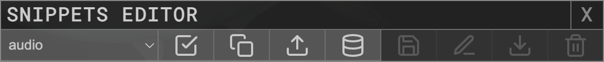
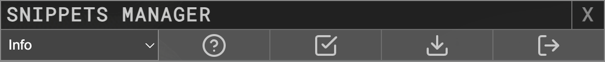

# P5LIVE Snippets
*A repo to collect user contributed P5LIVE Snippets!*

## Snippets Manager
To launch, toggle on the `Snippets Editor` (`CTRL + ALT + S`), click the . 

  

Doing so reveals this repo's [GitHub Pages](https://ffd8.github.io/P5LIVE-snippets/) embed within an iframe panel.  
You can always explore the manager directly to workshop a snippet, but it's probably more useful when launched within P5LIVE.

## Import Snippet
With the Snippets Manager toggled (see above), you can view and modify (non-destructive) snippets before potentially adding them to your own P5LIVE instance (works for both online and offline mode).

  

- `Select` snippet to preview
-  About Snippet, toggles credits.
-  Apply Snippet, to test what snippet does (start with a blank p5 sketch).
-  Export Snippet, to download selected snippet with any changes.
-  Import Snippet, to add snippet to your own P5LIVE `user` list of snippets.

Tip, to start with a blank p5 sketch within P5LIVE, create a new sketch, or select all, type `p5` and the `TAB` key to reveal the [`ace snippet`](https://github.com/ffd8/p5live?tab=readme-ov-file#ace-snippets) for a p5 sketch.

## Contribute Snippet
If you'd like to share your own P5LIVE snippets to this repo, making them available within the Snippets Manager, please take the following steps:

- Export snippet from P5LIVE `Snippets Editor`
- Drag + drop over Snippets Manager panel
- Toggle `About Snippet` to set name, author, about
- Reduce any unnecessary code from sections
- Double check external libraries CDN path
- Tidy sections of code
- `Export Snippet` to download as .json file
- Make [pull-request on github](https://github.com/ffd8/p5live-snippets/pulls) here with snippet!
- FYI, contributions may follow a small discussion to make sure snippet is as concise and applicable as possible.